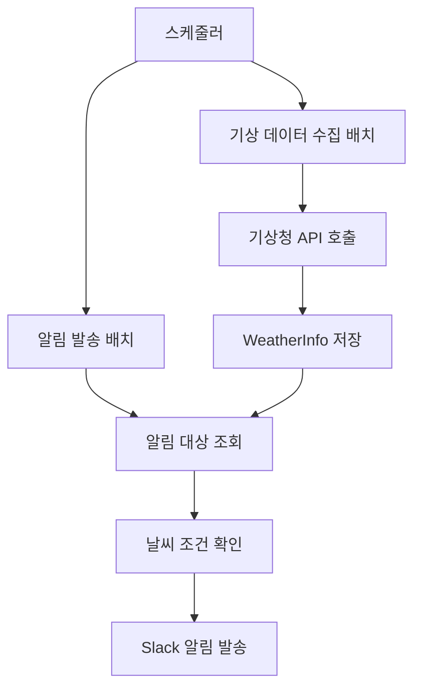

# Weather Batch System

날씨 정보 수집 및 알림 발송을 위한 Spring Batch 5.x 기반 배치 시스템입니다.

## 📋 주요 기능

### 1. 기상 데이터 수집 배치 (Tasklet)
- **Job**: `weatherDataFetchJob`
- **실행 주기**: 매일 5시, 8시, 14시, 20시 (기상청 발표 시각 기준)
- **기능**: 
  - 활성화된 알림 설정의 고유 좌표 수집
  - 기상청 단기예보 API 호출
  - WeatherInfo 엔티티에 날씨 데이터 저장

### 2. 알림 발송 배치 (Chunk)
- **Job**: `notificationSendJob`
- **실행 주기**: 매 30분마다
- **기능**:
  - 현재 시간 기준 ±30분 범위의 알림 대상 조회
  - 날씨 조건에 따른 알림 필터링
  - Slack 웹훅을 통한 알림 발송

### 3. 통합 프로세스 배치
- **Job**: `weatherProcessCompleteJob`
- **기능**: 기상 데이터 수집 → 알림 발송 순차 실행

## 🚀 실행 방법

### 자동 스케줄 실행
시스템이 시작되면 자동으로 스케줄러가 작동합니다.

```kotlin
// 기상 데이터 수집: 매일 5시, 8시, 14시, 20시
@Scheduled(cron = "0 0 5,8,14,20 * * *")

// 알림 발송: 매 30분마다
@Scheduled(cron = "0 */30 * * * *")
```

### 수동 실행 (테스트용)
배치 테스트 컨트롤러를 통해 수동 실행 가능합니다.

```bash
# 기상 데이터 수집 배치
POST /api/batch/weather-fetch

# 알림 발송 배치  
POST /api/batch/notification-send

# 전체 프로세스
POST /api/batch/complete-process
```

### 헬스 체크
```bash
# 기본 헬스 체크
GET /api/health

# 배치 상태 확인
GET /api/health/batch
```

## 🏗️ 아키텍처

### 배치 구조
```
WeatherBatchApplication
├── Config
│   ├── WeatherBatchJobConfig (Job/Step 정의)
│   └── BatchConfig (JobLauncher 설정)
├── Jobs
│   ├── weatherDataFetchJob (Tasklet)
│   ├── notificationSendJob (Chunk)
│   └── weatherProcessCompleteJob (Flow)
├── Tasklet
│   └── WeatherDataFetchTasklet
├── Chunk Processing
│   ├── NotificationItemReader
│   ├── NotificationItemProcessor
│   └── NotificationItemWriter
└── Scheduler
    └── WeatherBatchScheduler
```

### 데이터 플로우


## ⚙️ 설정

### application.yml
```yaml
# 기상청 API 설정
weather:
  api:
    kma:
      service-key: ${KMA_SERVICE_KEY}

# 배치 설정
spring:
  batch:
    job:
      enabled: false  # 자동 실행 방지
    jdbc:
      initialize-schema: always
```

### 환경 변수
- `KMA_SERVICE_KEY`: 기상청 API 서비스 키
- `VWORLD_SERVICE_KEY`: VWorld 지오코딩 API 서비스 키

## 📊 모니터링

### 로깅
- 배치 실행 상태 및 결과 로그
- 단계별 처리 건수 및 오류 정보
- API 호출 및 응답 로그

### 배치 상태 확인
```bash
curl http://localhost:8081/api/health/batch
```

응답 예시:
```json
{
  "status": "UP",
  "timestamp": "2025-01-16T10:30:00",
  "jobs": {
    "weatherDataFetchJob": {
      "lastExecution": "2025-01-16T08:00:00",
      "status": "COMPLETED"
    },
    "notificationSendJob": {
      "lastExecution": "2025-01-16T10:00:00", 
      "status": "COMPLETED"
    }
  }
}
```

## 🔧 주요 컴포넌트

### WeatherDataFetchTasklet
- 기상청 API를 통한 날씨 데이터 수집
- 중복 데이터 방지를 위한 조건 확인
- 좌표별 날씨 정보 파싱 및 저장

### NotificationItemReader  
- 현재 시간 기준 알림 대상 조회
- 알림 타입별 조건 확인 (DAILY, WEEKLY, CONDITIONAL)
- 날씨 정보와 알림 설정 매핑

### NotificationItemProcessor
- 날씨 조건에 따른 알림 필요성 판단
- Slack 메시지 포맷팅
- 이모지 및 경고 메시지 생성

### NotificationItemWriter
- Slack 웹훅을 통한 알림 발송
- 배치 단위 처리 (기본 10개씩)
- 발송 결과 로깅

## 🚨 에러 처리

### 배치 실패 시
- JobExecutionListener를 통한 실패 로그 기록
- Step별 실행 결과 및 오류 정보 수집
- 재시도 로직 없음 (다음 스케줄에서 재실행)

### API 호출 실패 시
- 로그 기록 후 다음 좌표 처리 계속
- 전체 배치 중단하지 않음

## 📈 성능 고려사항

### Chunk Size
- 알림 발송 배치: 10개씩 처리
- 메모리 사용량과 처리 속도의 균형

### API 호출 최적화
- 고유 좌표만 수집하여 중복 호출 방지
- 기존 데이터 존재 여부 확인 후 API 호출

### 데이터베이스
- 인덱스 활용한 효율적인 조회
- 배치 처리를 위한 적절한 트랜잭션 범위

## 🔄 운영

### 배포
```bash
# 배치 애플리케이션 빌드
./gradlew :modules:server:weather-batch:build

# 실행
java -jar weather-batch-0.0.1.jar
```

### 로그 확인
```bash
# 실시간 로그 확인
tail -f logs/weather-batch.log

# 특정 배치 로그 필터링
grep "weatherDataFetchJob" logs/weather-batch.log
```
